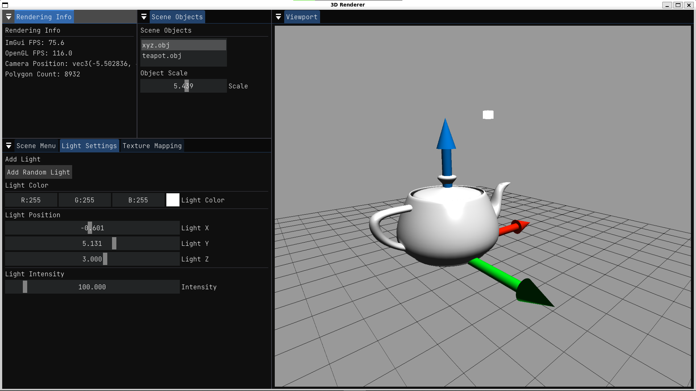
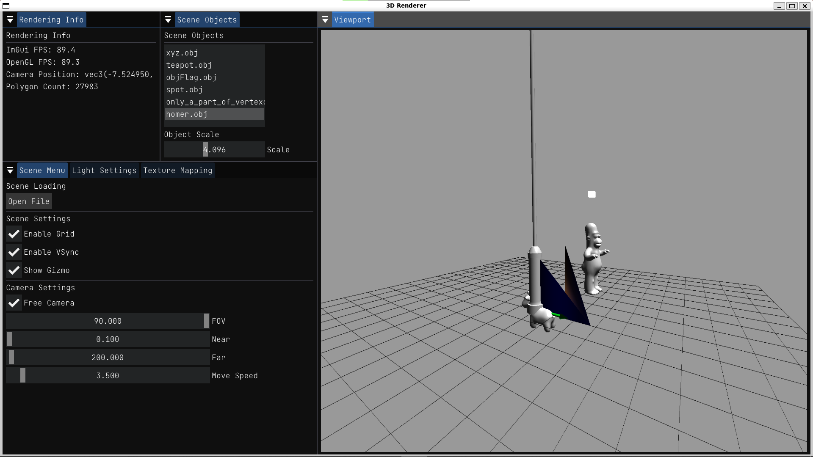
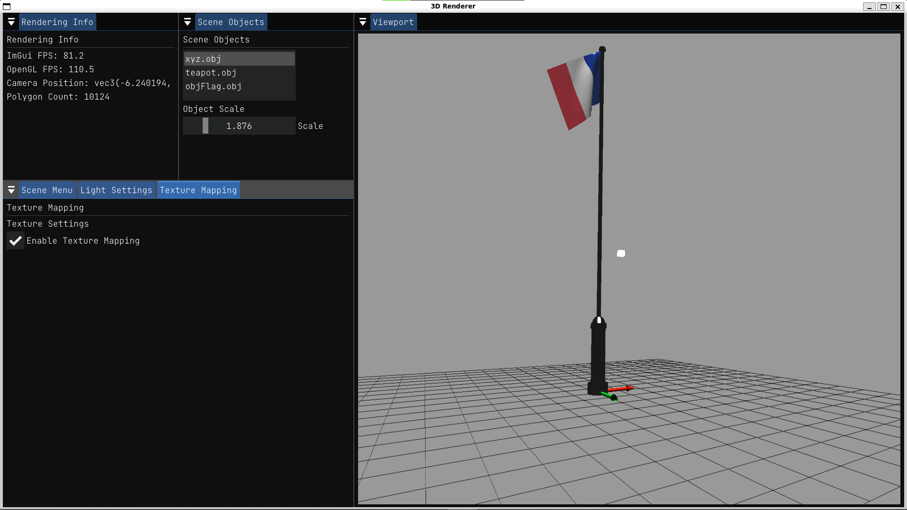
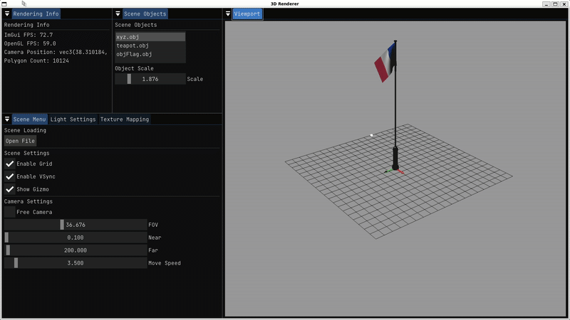

# OpenGL_3D_Renderer

## Description

Minimal OpenGL 3D Renderer made using ImGui for UI, GLFW and GLAD for OpenGL and linking to functions as well as Assimp for loading object meshes/scenes along with STB_IMAGE headers for loading textures from files. All these libraries were installed using Conan Package Manager.
  
## Build
There are two ways to build this project:  
* Use the provided bash scripts to execute the necessary command (for ease of life). The scripts included for installing the libraries via Conan and build the project with CMake and re-compile the project are build.sh and rebuild.sh respectively
* Use the below commands manually:

First off, clone the repository:
```bash
git clone https://github.com/Notgard/OpenGL_3D_Renderer.git && cd OpenGL_3D_Renderer
```
And now execute the following commands:
```bash
mkdir -p build
cd build
conan install .. --update --build=missing --remote=conancenter
cmake -G Ninja -DCMAKE_BUILD_TYPE=Release\
   -DCMAKE_INSTALL_PREFIX="../install"\
   -DUSING_PACKAGE_MANAGER_CONAN=1\
   -DCMAKE_PREFIX_PATH="./Release/generators"\
   -DCMAKE_TOOLCHAIN_FILE=./Release/generators/conan_toolchain.cmake\
   ..
cmake --build . --target install
```
  
## Usage
You can use the `build.sh` or `rebuild.sh` to compile the project without needing to type the commands out yourself.  
To start the application, simply use the `start.sh` script which starts the renderer, the scripts additionally prompts you to use either the `--no-nvidia` or `--with-nvidia` flags to use the proper GPU in case of laptop integrated GPU case.
  
Note that this project was made on Windows Subsystem for Linux (WSL2) running Ubuntu 22.04 with MESA for OpenGL driver support.

## Demo

### Basic model import



### Multi-object import and independant object handling


### Texture handling of imported models


### Different camera modes (scene rotation + free movement camera)
